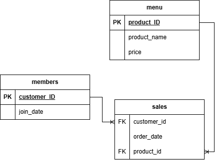

# Case Study #1: Danny's Diner 🍜

## Business Problem

Danny's Diner wants to better understand customer purchasing
behavior, spending patterns, menu preferences, and loyalty
program activity.

## Dataset

The analysis uses three datasets:

- `sales`
- `menu`
- `members`

## Entity Relationship Diagram

The Danny's Diner dataset consists of three tables: `sales`, `menu`, and `members`.

## Questions & Solutions

# What is the total amount each customer spent at the restaurant?
